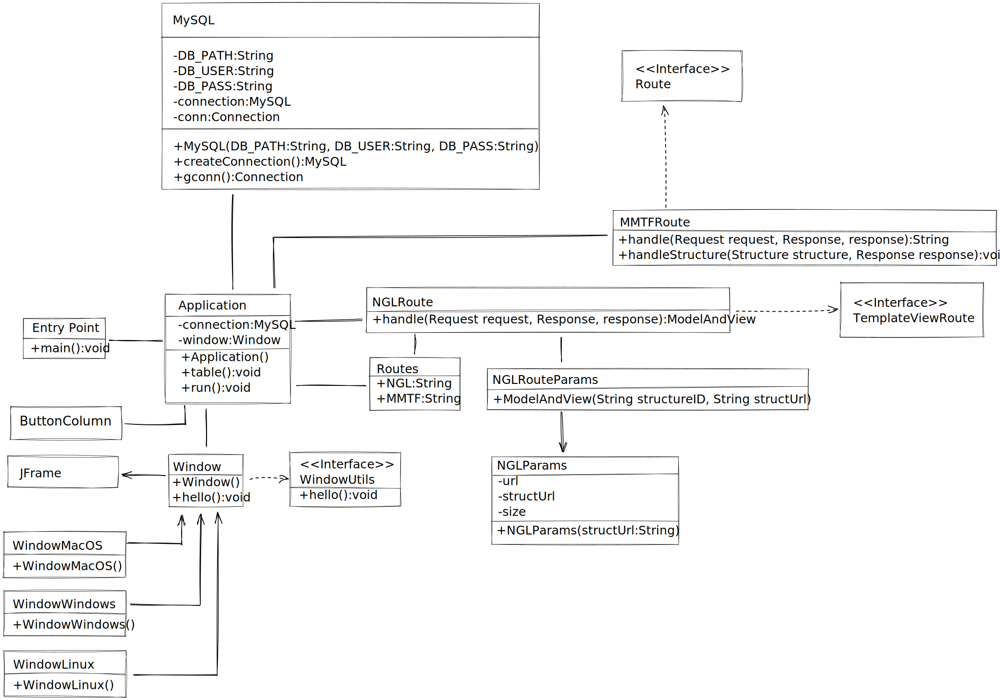

# visiogenomx


The theme of this project is bioinformatics.

# Features Shipped
- [x] Database connectivity
- [x] Protein visualizer using BioJava and NGL View

# Class Architecture


# Programs and libraries hosted in this solution
- [junit](https://junit.org/junit5/) - Unit testing
- [mysql-connector-java](https://mvnrepository.com/artifact/mysql/mysql-connector-java) - Java JDBC
- [xampp](https://www.apachefriends.org/index.html) - Used for MYSQL db hosting
- [spark](https://sparkjava.com/) - Used for the web application

# Supported platforms / recommended toolchains
The following are recommended toolchains for popular platforms.

Windows [Intellij IDEA](), Java SDK 17. 

# Build system generation
```bash
mvn package
```

# If you want to contribute follow the next steps
First, click on the **Fork button** in the top-right corner. 

This creates a new copy of this repository under your GitHub user account with a URL like:
```bash
https://github.com/<YourUserName>/visiogenomx
```

---

Next, clone the repo by opening the terminal on your computer and running the command:

```bash
git clone https://github.com/<YourUserName>/visiogenomx.git
```

---

Create a new remote for the upstream repo with the command:
```bash
git remote add upstream https://github.com/vasilecampeanu/visiogenomx
```